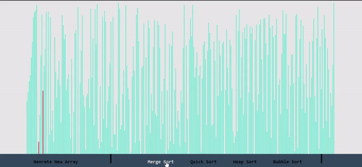

How to Make it Work for yourself
-Download the source code to src folder
-Run it using ReactJS by creating a new reactjs app and replacing the src folder code

Link -- https://daljeet-sandhu.github.io/sorting-visualizer/

# Sorting-visualizer

Designed a web page which visually sort arrays using different sorting algorithms like Heap, Merge, Quick and Bubble
Used ReactJS to improve understanding of user interface design, testing and debugging within a website
Improved the concepts of data structures and algorithms, as well as the front-end development

1. Heap Sort
2. Merge Sort
3. Quick Sort
4. Bubble Sort

# Before:

# After:

